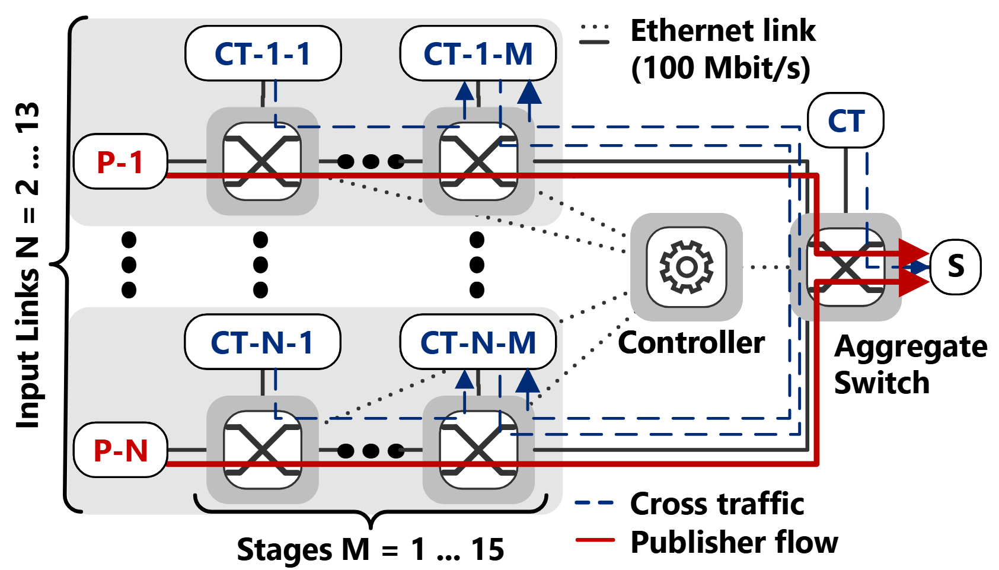

# CBS Maximum Latency Study

## Reference
> Timo Salomon, Lisa Maile, Philipp Meyer, Franz Korf, Thomas C. Schmidt, "Negotiating strict latency limits for dynamic real-time services in vehicular time-sensitive networks," Vehicular Communications, vol. 57, p. 100 985, Feb. 2026. DOI: 10.1016/j.vehcom.2025.100985
```bibtex
@Article{smmks-nslld-25,
  author    = {Timo Salomon and Lisa Maile and Philipp Meyer and Franz Korf and Thomas C. Schmidt},
  journal   = {Vehicular Communications},
  title     = {{Negotiating strict latency limits for dynamic real-time services in vehicular time-sensitive networks}},
  year      = {2026},
  month     = feb,
  pages     = {100985},
  volume    = {57},
  doi       = {10.1016/j.vehcom.2025.100985},
  publisher = {Elsevier},
}
```

## Scenario
We establish near worst-case conditions in this scenario.
Publishers in two to thirteen input links (N) send to a subscriber via a series of one to fifteen switch stages (M), paired with a cross traffic (CT) generator. An aggregate switch merges the input links and connects to the subscriber. The link bandwidth is 100 Mbit/s.

Publishers send one frame every 125 µs with highest priority. 
Their frame size varies with the number of input links to achieve a total of 75 Mbit/s sent to the subscriber.

Each CT targets one link in the publisher’s path, sending traffic to the next CT node, which allows for maximum interference. The last node in the chain sends to the next input link via the aggregate switch. A final CT sends to the subscriber through the aggregate switch.

In our study, the CT along the stages either sends full-size Ethernet frames as best effort (BECT), or frames with the same priority as the publishers (PCT). 
The PCT is configured to utilize the remaining bandwidth left by the publisher to reach the total of 75 Mbit/s on each input link. 
The CT interval is set to 100 ms to produce repeatable burst patterns.




## Configurations
This DYRECTsn scenario produces the Network Calculus (NC) idle slope configurations and worst case latency analysis for the full parameter study. 
This can then be converted into an OMNeT++ ini file to be used with the simulator for evaluations. 

CMI and configurations are solely calculated by the OMNeT++ simulation environment.
Check the full [workspace repository](https://github.com/CoRE-RG/vehcom25-soa-strict-cbs-latency) for the VehCom 2025 paper evaluation setup.

## Study Execution and Evaluation
The analysis was done in Ubuntu 22.04 (WSL).

### Run Studies

```find_best_solution.sh``` this will execute the ```cbsstudy_run_scenario.py``` for 100 times to find a good configuration for delay budgets using the meta-heuristic in DYRECTsn.  

```run_study.sh``` will run a set of parameters for the parameter study. Execute from this directory, creates a results folder.

### Integration with OMNeT++ and TSNLatencyAnalysis
```ResultsToConfig.ipynb``` The notebook provides a set of cells to parse the results from the results dir and create an nc_config.ini file for the OMNeT++ simulation. 
Check the full [workspace repository](https://github.com/CoRE-RG/vehcom25-soa-strict-cbs-latency) for the VehCom 2025 paper evaluation setup.
